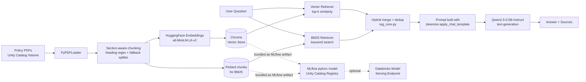

# PolicyRAG
### An open-source RAG chatbot for company policy Q&A, built on Databricks


This is a chatbot that answers questions about company policy documents. It's built
using RAG (Retrieval-Augmented Generation), which just means the AI doesn't answer
from memory — it actually goes and reads the real policy PDFs first, finds the part
that matches the question, and then writes the answer based on that, with a citation
for every claim it makes.

Everything runs on Databricks, and all the AI models are free and open-source, from
Hugging Face. No API keys, no per-question fees. You just pay for the Databricks
compute you'd already be using anyway.

## Example

```
> print(rag_chain.invoke("What is the company's rule for everyone?"))

The company's rules for everyone include:

- Honesty and Fair Dealing: Employees are not allowed to take unfair advantage of
  anyone by manipulating, concealing, abusing privileged information, or
  misrepresenting material facts.
- Confidential and Proprietary Information: All company records, expense reports,
  and financial statements must be accurate and fair, reflecting all transactions
  and events without any manipulation, concealment, abuse of privileged
  information, or misrepresentation of material facts.
- Fair Competition and Antitrust: Companies are required to maintain fairness and
  competition, avoiding unfair competition and anticompetitive practices.
- Workplace Respect and Non-Discrimination: The company emphasizes workplace
  respect and non-discrimination, ensuring equal treatment and opportunities for
  all employees.
```

That's a real answer, not something I wrote myself. It comes from the model reading
the actual "Code of Conduct & Business Ethics Policy" PDF and summarizing what it
found.

Here's what it actually looks like running in the notebook, on a different question
about parental leave:


> **Note:** this screenshot and the example above are from an earlier run, before
> hybrid retrieval and citations were added. The chain now also returns a `sources`
> list alongside every answer — see the "Retrieve and generate" section below. If
> you're updating this repo from a fresh run, swap in a new screenshot that shows
> the `Sources:` output too.

## How it works



Here's what each part of the pipeline actually does, with the real code behind it.

### 1. Read the PDFs and split them into section-aware chunks

The code reads every page of every PDF, then splits the text on detected section
headings — things like `SECTION 1:`, `3.2 Reimbursement`, `ARTICLE 4`, or an ALL-CAPS
heading line — so each chunk is a complete section rather than an arbitrary slice of
text. Anything before the first heading (a title page, a short intro) still becomes
its own chunk instead of being dropped. Any section that's still too long on its own
gets sub-split with a standard recursive character splitter.

```python
HEADER_PATTERN = re.compile(
    r"(?m)^(?:"
    r"(?:SECTION|Section|ARTICLE|Article)\s+\d+[:.\-]?.*|"   # "SECTION 1:", "Article 3 -"
    r"\d+(?:\.\d+)*\s+[A-Z][^\n]{0,80}|"                      # "3.2 Reimbursement"
    r"[A-Z][A-Z0-9 &/,\-]{4,80}$"                              # ALL CAPS HEADING
    r")"
)

def split_by_sections(full_text):
    matches = list(HEADER_PATTERN.finditer(full_text))
    if not matches:
        return [{"text": t, "section": None} for t in _sub_splitter.split_text(full_text)]

    pieces = []
    preamble = full_text[:matches[0].start()].strip()  # keep any text before the first heading
    if preamble:
        pieces.append({"text": preamble, "section": None})

    for i, m in enumerate(matches):
        start = m.start()
        end = matches[i + 1].start() if i + 1 < len(matches) else len(full_text)
        pieces.append({"text": full_text[start:end].strip(), "section": m.group().strip()})
    return pieces
```

Each chunk keeps its source file, page number, and section title as metadata — that's
what makes citations possible later on. A quick sanity check on the actual chunk
sizes after splitting:


### 2. Turn the text into numbers and save it

Each chunk gets converted into a list of 384 numbers by a small embedding model.
That list of numbers is called an embedding, and it's what lets the computer figure
out how close two pieces of text are in meaning. All of it gets saved into a Chroma
vector database on disk. The raw chunks also get pickled separately — BM25 (the
keyword search half of retrieval) isn't a saved index the way Chroma is, it's rebuilt
in memory from these same chunks whenever it's needed.

```python
embeddings = HuggingFaceEmbeddings(
    model_name="sentence-transformers/all-MiniLM-L6-v2",  # which embedding model to use
    model_kwargs={"device": "cpu"}  # run it on CPU — no GPU needed, this model is small
)
vector_store = Chroma.from_documents(
    documents=doc_chunks,               # the chunks from the step above
    embedding=embeddings,               # the model that turns each chunk into a vector
    persist_directory=VECTOR_DB_PATH    # where Chroma saves the database on disk
)

with open(CHUNKS_PATH, "wb") as f:
    pickle.dump(doc_chunks, f)  # so BM25 can be rebuilt later, at serving time
```

And here's what the embedded chunks actually look like once they're pulled out of
Chroma and displayed as a table:


### 3. Retrieve and generate the answer (the actual RAG part)

This is the core of the project, and it lives in `src/rag_core.py` so the notebook and
the deployed model share the exact same implementation. When someone asks a question,
two retrievers run: a vector (semantic) search and a BM25 (keyword) search. Vector
search is good at matching meaning; BM25 is good at catching exact terms — a policy
number, a dollar figure, a specific date — that a semantic match can miss. The results
are merged and de-duplicated, then used to build both the answer and a structured
citation list.

```python
def make_hybrid_retriever(vector_retriever, bm25_retriever):
    def hybrid_retrieve(query):
        vector_docs = vector_retriever.invoke(query)
        keyword_docs = bm25_retriever.invoke(query)
        seen, merged = set(), []
        for pair in zip(keyword_docs, vector_docs):
            for doc in pair:
                if doc.page_content not in seen:
                    seen.add(doc.page_content)
                    merged.append(doc)
        return merged
    return hybrid_retrieve

def build_rag_chain(vector_retriever, bm25_retriever, tokenizer, llm):
    hybrid_retrieve = make_hybrid_retriever(vector_retriever, bm25_retriever)
    build_prompt = make_build_prompt(tokenizer)

    def retrieve_and_package(query):
        docs = hybrid_retrieve(query)  # retrieve once, reuse for both the answer and the citations
        return {"context": format_docs(docs), "sources": get_sources(docs), "question": query}

    return (
        RunnableLambda(retrieve_and_package)
        | RunnableParallel(
            answer=RunnableLambda(build_prompt) | llm | StrOutputParser(),
            sources=RunnableLambda(lambda x: x["sources"]),
        )
    )
```

The system prompt asks the model to cite `(Source: <file>, page <n>)` after every
claim, and `get_sources()` independently builds a citation list straight from the
retrieved chunks' metadata — so the sources shown alongside an answer come from what
was actually retrieved, not just from trusting the model's own citations.

I used `tokenizer.apply_chat_template(...)` here instead of writing the prompt tags by
hand. That way, if I switch to a different model later, the prompt still comes out
right without me having to rewrite it.

### 4. Package it for real use

Everything gets wrapped in an MLflow model class so it can be registered to Unity
Catalog and, if needed, turned into a real API later. `agent.py` doesn't reimplement
the retrieval/prompting logic — it imports `build_rag_chain` from `rag_core.py`, the
same module the notebook uses, and that module gets bundled alongside it at logging
time.

```python
class RAGPolicyAgent(mlflow.pyfunc.PythonModel):  # MLflow's required base class for a custom model
    def load_context(self, context):
        # loads the vector store and pickled chunks from bundled MLflow artifacts,
        # not from a hardcoded local path — see "Problems I ran into" below
        ...
        self.rag_chain = build_rag_chain(vector_retriever, bm25_retriever, tokenizer, llm)

    def predict(self, context, model_input):        # runs every time someone calls the deployed model
        query = model_input["user_message"].iloc[0]  # pull the question out of the incoming request
        result = self.rag_chain.invoke(query)
        return {"response": result["answer"], "sources": json.dumps(result["sources"])}
```

```python
mlflow.pyfunc.log_model(
    name="agent",
    python_model="agent.py",
    code_paths=["rag_core.py"],  # bundles the shared module so agent.py can import it anywhere
    artifacts={"vector_db": VECTOR_DB_PATH, "doc_chunks": CHUNKS_PATH},
    ...
)
```

## What I used

| Layer                     | Tool                                              |
|---------------------------|----------------------------------------------------|
| Orchestration             | LangChain (LCEL chains)                            |
| Embedding model           | `sentence-transformers/all-MiniLM-L6-v2` (Hugging Face) |
| Vector store              | Chroma                                             |
| Keyword search            | BM25 (`rank_bm25`)                                 |
| LLM                       | `Qwen/Qwen2.5-0.5B-Instruct` (Hugging Face)         |
| Compute / notebook        | Databricks                                         |
| Model registry            | MLflow pyfunc + Unity Catalog                      |

All of these models are open-weight and run directly on the cluster's CPU, so there's
no external API key involved and no cost per question beyond the compute itself.

## How to run this

1. Upload your policy PDFs to a Unity Catalog Volume, something like
   `/Volumes/workspace/default/company_policy/`.
2. Open `notebooks/policy_rag_agent.ipynb` in Databricks and run the cells top to
   bottom:

   | Step | What it does |
   |------|---------------|
   | Install dependencies | Installs the packages needed, including `rank_bm25` and `mlflow` |
   | Load & chunk PDFs | Loads the PDFs, splits them by section, embeds and saves to Chroma, and pickles the chunks |
   | Write `rag_core.py` | Writes the shared retrieval/prompting/citation module to disk |
   | Build the chain | Builds the hybrid (vector + BM25) retriever and the LLM, assembles the chain, and tries one test question |
   | Write `agent.py` | Writes the deployable model file, which imports `rag_core.py` |
   | Register the model | Logs and registers the model — with `rag_core.py` bundled via `code_paths` — to Unity Catalog |

3. Ask it anything, right in the notebook:
   ```python
   result = rag_chain.invoke("What is the travel reimbursement policy?")
   print(result["answer"])
   print(result["sources"])
   ```
4. If you want, you can deploy the registered model as a Databricks Model Serving
   endpoint so other apps can call it too — `src/agent.py` is the version built for
   that.

> Sample PDFs aren't included in this repo — you'll need to point it at your own
> documents.

## Project structure

```
policy-rag-agent/
├── README.md
├── LICENSE
├── requirements.txt
├── notebooks/
│   └── policy_rag_agent.ipynb   # the full pipeline, start to finish
└── src/
    ├── rag_core.py              # shared retrieval/prompting/citation logic
    └── agent.py                 # standalone copy of the deployable model
```

## Problems I ran into

A few things came up while building this that are worth mentioning:

- **The vector database wasn't saved in the right place.** At first I saved Chroma to
  a `/tmp` folder on the cluster. That's fine while testing in the notebook, but once
  the model actually gets deployed, it runs on a different machine that doesn't have
  that `/tmp` folder at all. So it would quietly load an empty database — no error, just
  wrong-looking answers. I fixed it by bundling the whole vector database folder into
  the MLflow model itself.
- **The prompt format was too specific to one model.** I was writing the prompt
  template by hand using tags like `<|im_start|>`, which only works for that exact
  model. I switched to the model's own `apply_chat_template()` function instead, so it
  keeps working if I swap in a different model later.
- **Answers were getting cut off.** `max_new_tokens` was set too low, so longer answers
  were getting cut off mid-sentence. I raised the limit so it can actually finish what
  it's saying.
- **Vector search alone missed exact terms.** A question about a specific policy
  number or dollar figure could fail if the embedding didn't capture that detail well.
  Adding BM25 keyword search alongside it, and merging the two result sets, fixed that.
- **600-character chunks were slicing sections in half.** A rule or clause could get
  cut mid-sentence just because it happened to sit on a chunk boundary. Switching to
  heading-based chunking keeps each section whole, only falling back to a character
  split when a section is too long on its own.
- **The notebook and the deployed model had two separate copies of the same logic.**
  The retrieval/prompting/citation code used to be written once in the notebook and
  then re-typed into an escaped string to generate `agent.py`. That's exactly the kind
  of thing that quietly drifts out of sync — moving it into `rag_core.py` and having
  both places import it means there's only one version of that logic to get right.
- **Retrieval was accidentally running twice per question.** The chain used to compute
  the answer's context and the citation list as two separate branches that each called
  the retriever independently — meaning every question triggered two full retrieval
  passes for no reason. Restructuring it to retrieve once and derive both outputs from
  that single result fixed it.

## What I might do next

- Try Databricks Vector Search instead of Chroma, so the data isn't stuck on local
  disk and I can actually browse it inside Databricks like a normal table.
- Swap the small local model for a bigger one through the Databricks Foundation Model
  API, for better answer quality.
- Add a small evaluation set — a handful of questions with known-good answers — to
  measure whether hybrid retrieval is actually outperforming vector-only search,
  instead of just assuming it from the design.

## License

MIT — see [LICENSE](LICENSE).
