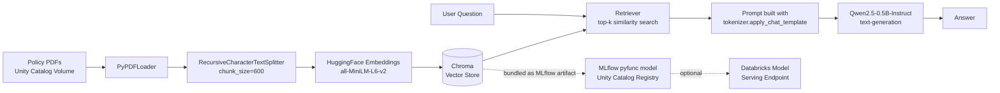

# 📄 Company Policy RAG Assistant


This is a chatbot that answers questions about company policy documents. It's built
using RAG (Retrieval-Augmented Generation), which just means the AI doesn't answer
from memory — it actually goes and reads the real policy PDFs first, finds the part
that matches the question, and then writes the answer based on that.

Everything runs on Databricks, and all the AI models are free and open-source, from
Hugging Face. No API keys, no per-question fees. You just pay for the Databricks
compute you'd already be using anyway.

## Example

```
> print(rag_chain.invoke("What is the company's rule for everyone?"))

The company's rules for everyone include:

- Honesty and Fair Dealing: Employees are not allowed to take unfair advantage of
  anyone by manipulating, concealing, abusing privileged information, or
  misrepresenting material facts.
- Confidential and Proprietary Information: All company records, expense reports,
  and financial statements must be accurate and fair, reflecting all transactions
  and events without any manipulation, concealment, abuse of privileged
  information, or misrepresentation of material facts.
- Fair Competition and Antitrust: Companies are required to maintain fairness and
  competition, avoiding unfair competition and anticompetitive practices.
- Workplace Respect and Non-Discrimination: The company emphasizes workplace
  respect and non-discrimination, ensuring equal treatment and opportunities for
  all employees.
```

That's a real answer, not something I wrote myself. It comes from the model reading
the actual "Code of Conduct & Business Ethics Policy" PDF and summarizing what it
found.

Here's what it actually looks like running in the notebook, on a different question
about parental leave:


## How it works



Below is the full code from every cell in the notebook, in order — not trimmed
snippets, this is exactly what's in `notebooks/policy_rag_agent.ipynb`.

### Cell 1 — Install the dependencies

```python
%pip install langchain langchain-community langchain-huggingface langchain-chroma langchain-text-splitters sentence-transformers chromadb pypdf -q
dbutils.library.restartPython()
```

### Cell 2 — Load the PDFs, chunk them, and build the vector store

This one cell does three things: reads every page of every PDF, splits the text into
~600-character chunks with a 60-character overlap (so a sentence sitting on a chunk
boundary doesn't lose its meaning), then embeds each chunk and saves everything into
a Chroma vector database.

```python
import glob
from langchain_community.document_loaders import PyPDFLoader
from langchain_text_splitters import RecursiveCharacterTextSplitter
from langchain_huggingface import HuggingFaceEmbeddings
from langchain_chroma import Chroma

PDF_FOLDER_PATH = "/Volumes/workspace/default/company_policy"
VECTOR_DB_PATH = "/tmp/chroma_policy_db"
EMBEDDING_MODEL = "sentence-transformers/all-MiniLM-L6-v2"

# 1. Load all PDFs
pdf_files = glob.glob(f"{PDF_FOLDER_PATH}/*.pdf")
print(f"Found {len(pdf_files)} PDF files.")

pdf_documents = []
for file_path in pdf_files:
    print(f"Loading {file_path}...")
    pdf_documents.extend(PyPDFLoader(file_path).load())
print(f"Loaded {len(pdf_documents)} total pages.")

# 2. Chunk
text_splitter = RecursiveCharacterTextSplitter(chunk_size=600, chunk_overlap=60)
doc_chunks = text_splitter.split_documents(pdf_documents)
print(f"Created {len(doc_chunks)} chunks.")

# 3. Embed + persist to Chroma
embeddings = HuggingFaceEmbeddings(model_name=EMBEDDING_MODEL, model_kwargs={"device": "cpu"})

vector_store = Chroma.from_documents(
    documents=doc_chunks,
    embedding=embeddings,
    persist_directory=VECTOR_DB_PATH
)
print("Vector DB built and saved.")
```

A quick sanity check on the actual chunk sizes after splitting:


And here's what the embedded chunks actually look like once they're pulled out of
Chroma and displayed as a table — 200 rows, one per chunk, each with its own vector:


### Cell 3 — Build the RAG chain and test it

This is the core of the project. Given a question, the chain searches the vector
database for the 3 chunks that match it best, formats them and the question into a
prompt using the model's own chat template, and runs it through the LLM.

```python
from transformers import AutoModelForCausalLM, AutoTokenizer, pipeline
from langchain_huggingface import HuggingFacePipeline
from langchain_core.runnables import RunnablePassthrough, RunnableLambda
from langchain_core.output_parsers import StrOutputParser

MODEL_ID = "Qwen/Qwen2.5-0.5B-Instruct"

tokenizer = AutoTokenizer.from_pretrained(MODEL_ID)
model = AutoModelForCausalLM.from_pretrained(MODEL_ID)

pipe = pipeline(
    "text-generation",
    model=model,
    tokenizer=tokenizer,
    max_new_tokens=150,
    do_sample=False,               # explicit: avoids the temperature/do_sample warning
    return_full_text=False,
    clean_up_tokenization_spaces=False
)
pipe.model.config.max_length = None
llm = HuggingFacePipeline(pipeline=pipe)

SYSTEM_PROMPT = (
    "You are a helpful company policy assistant. Answer the user's question "
    "using ONLY the provided context. If the context does not contain the "
    "answer, state that you do not know."
)

def format_docs(docs):
    return "\n\n".join(doc.page_content for doc in docs)

def build_prompt(inputs):
    # Uses the model's own chat template instead of hand-written ChatML tags
    messages = [
        {"role": "system", "content": SYSTEM_PROMPT},
        {"role": "user", "content": f"Context:\n{inputs['context']}\n\nQuestion: {inputs['question']}"}
    ]
    return tokenizer.apply_chat_template(messages, tokenize=False, add_generation_prompt=True)

retriever = vector_store.as_retriever(search_kwargs={"k": 3})

rag_chain = (
    {"context": retriever | format_docs, "question": RunnablePassthrough()}
    | RunnableLambda(build_prompt)
    | llm
    | StrOutputParser()
)

print("RAG chain ready!")

# Quick test
question = "Who does the Travel & Expense Reimbursement Policy apply to?"
print(f"Question: {question}\n")
print("Answer:", rag_chain.invoke(question))
```

I used `tokenizer.apply_chat_template(...)` here instead of writing the prompt tags by
hand. That way, if I switch to a different model later, the prompt still comes out
right without me having to rewrite it.

### Cell 4 — Generate `agent.py` for deployment

This writes out a self-contained version of the pipeline as its own Python file,
which is what actually gets registered and served. It has to be self-contained
because a deployed model runs on different infrastructure than the notebook — it
can't just reuse variables that were already in memory.

```python
agent_code = """
import pandas as pd
import mlflow
from langchain_huggingface import HuggingFaceEmbeddings, HuggingFacePipeline
from langchain_chroma import Chroma
from langchain_core.runnables import RunnablePassthrough, RunnableLambda
from langchain_core.output_parsers import StrOutputParser
from transformers import AutoModelForCausalLM, AutoTokenizer, pipeline

MODEL_ID = "Qwen/Qwen2.5-0.5B-Instruct"
EMBEDDING_MODEL = "sentence-transformers/all-MiniLM-L6-v2"
SYSTEM_PROMPT = (
    "You are a helpful company policy assistant. Answer the user's question "
    "using ONLY the provided context. If the context does not contain the "
    "answer, state that you do not know."
)

def format_docs(docs):
    return "\\n\\n".join(doc.page_content for doc in docs)

class RAGPolicyAgent(mlflow.pyfunc.PythonModel):
    def load_context(self, context):
        # vector_db path comes from the bundled MLflow artifact, NOT a hardcoded /tmp path
        embeddings = HuggingFaceEmbeddings(model_name=EMBEDDING_MODEL, model_kwargs={"device": "cpu"})
        vector_store = Chroma(
            persist_directory=context.artifacts["vector_db"],
            embedding_function=embeddings
        )
        retriever = vector_store.as_retriever(search_kwargs={"k": 3})

        tokenizer = AutoTokenizer.from_pretrained(MODEL_ID)
        model = AutoModelForCausalLM.from_pretrained(MODEL_ID)
        pipe = pipeline(
            "text-generation",
            model=model,
            tokenizer=tokenizer,
            max_new_tokens=150,
            do_sample=False,
            return_full_text=False,
            clean_up_tokenization_spaces=False
        )
        pipe.model.config.max_length = None
        llm = HuggingFacePipeline(pipeline=pipe)

        def build_prompt(inputs):
            messages = [
                {"role": "system", "content": SYSTEM_PROMPT},
                {"role": "user", "content": f"Context:\\n{inputs['context']}\\n\\nQuestion: {inputs['question']}"}
            ]
            return tokenizer.apply_chat_template(messages, tokenize=False, add_generation_prompt=True)

        self.rag_chain = (
            {"context": retriever | format_docs, "question": RunnablePassthrough()}
            | RunnableLambda(build_prompt)
            | llm
            | StrOutputParser()
        )

    def predict(self, context, model_input):
        if isinstance(model_input, pd.DataFrame):
            query = model_input["user_message"].iloc[0]
        elif isinstance(model_input, dict):
            query = model_input.get("user_message", "")
        else:
            query = str(model_input)
        return {"response": self.rag_chain.invoke(query)}

mlflow.models.set_model(RAGPolicyAgent())
"""

with open("agent.py", "w") as f:
    f.write(agent_code)

print("agent.py generated successfully.")
```

### Cell 5 — Register the model to Unity Catalog

The last step registers the model, bundling the Chroma folder in as an artifact so
the deployed version isn't pointing at a `/tmp` path that won't exist once it's
running somewhere else (see "Problems I ran into" below).

```python
import mlflow
import pandas as pd
from mlflow.models.signature import ModelSignature
from mlflow.types.schema import Schema, ColSpec

catalog = "workspace"
schema = "default"
model_name = "policy_rag_agent"
full_model_path = f"{catalog}.{schema}.{model_name}"

input_schema = Schema([ColSpec("string", "user_message")])
output_schema = Schema([ColSpec("string", "response")])
signature = ModelSignature(inputs=input_schema, outputs=output_schema)
input_example = pd.DataFrame([{"user_message": "What is the travel policy?"}])

with mlflow.start_run(run_name="serving_model_registration"):
    model_info = mlflow.pyfunc.log_model(
        python_model="agent.py",
        artifact_path="agent",
        artifacts={"vector_db": VECTOR_DB_PATH},   # bundles the DB so it's not just a local /tmp path
        signature=signature,
        input_example=input_example,
        registered_model_name=full_model_path
    )
    print(f"Model registered to Unity Catalog: {full_model_path}")
```

## What I used

| Layer                     | Tool                                              |
|---------------------------|----------------------------------------------------|
| Orchestration             | LangChain (LCEL chains)                            |
| Embedding model           | `sentence-transformers/all-MiniLM-L6-v2` (Hugging Face) |
| Vector store              | Chroma                                             |
| LLM                       | `Qwen/Qwen2.5-0.5B-Instruct` (Hugging Face)         |
| Compute / notebook        | Databricks                                         |
| Model registry            | MLflow pyfunc + Unity Catalog                      |

All of these models are open-weight and run directly on the cluster's CPU, so there's
no external API key involved and no cost per question beyond the compute itself.

## How to run this

1. Upload your policy PDFs to a Unity Catalog Volume, something like
   `/Volumes/workspace/default/company_policy/`.
2. Open `notebooks/policy_rag_agent.ipynb` in Databricks and run the cells top to
   bottom:

   | Cell | What it does |
   |------|---------------|
   | 1 | Installs the packages you need |
   | 2 | Loads the PDFs, splits them, and saves the embeddings into Chroma |
   | 3 | Builds the RAG chain and tries one test question |
   | 4 | Writes out `agent.py`, the version of the code meant for deployment |
   | 5 | Registers the model into Unity Catalog |

3. Ask it anything, right in the notebook:
   ```python
   print(rag_chain.invoke("What is the travel reimbursement policy?"))
   ```
4. If you want, you can deploy the registered model as a Databricks Model Serving
   endpoint so other apps can call it too — `src/agent.py` is the version built for
   that.

> Sample PDFs aren't included in this repo — you'll need to point it at your own
> documents.

## Project structure

```
policy-rag-agent/
├── README.md
├── LICENSE
├── requirements.txt
├── notebooks/
│   └── policy_rag_agent.ipynb   # the full pipeline, start to finish
└── src/
    └── agent.py                 # standalone copy of the deployable model
```

## Problems I ran into

A few things came up while building this that are worth mentioning:

- **The vector database wasn't saved in the right place.** At first I saved Chroma to
  a `/tmp` folder on the cluster. That's fine while testing in the notebook, but once
  the model actually gets deployed, it runs on a different machine that doesn't have
  that `/tmp` folder at all. So it would quietly load an empty database — no error, just
  wrong-looking answers. I fixed it by bundling the whole vector database folder into
  the MLflow model itself.
- **The prompt format was too specific to one model.** I was writing the prompt
  template by hand using tags like `<|im_start|>`, which only works for that exact
  model. I switched to the model's own `apply_chat_template()` function instead, so it
  keeps working if I swap in a different model later.
- **Answers were getting cut off.** `max_new_tokens` was set too low, so longer answers
  (like the full list of rules above) were getting cut off mid-sentence. I raised the
  limit so it can actually finish what it's saying.

## What I might do next

- Try Databricks Vector Search instead of Chroma, so the data isn't stuck on local
  disk and I can actually browse it inside Databricks like a normal table.
- Swap the small local model for a bigger one through the Databricks Foundation Model
  API, for better answer quality.
- Add some kind of evaluation to measure whether the answers are actually good,
  instead of just checking them by hand.

## License

MIT — see [LICENSE](LICENSE).
