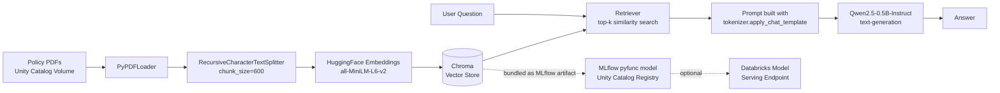

# 📄 Company Policy RAG Assistant

A Retrieval-Augmented Generation (RAG) chatbot that answers employee questions about
company policy documents — built end-to-end on Databricks using only free, open-source
models (no API keys, no per-token billing).

Ask it things like *"Who does the travel reimbursement policy apply to?"* and it retrieves
the relevant passages from the company's policy PDFs and generates a grounded answer —
instead of guessing from the model's general training data.

## How it works



## Tech stack

| Layer                     | Tool                                              |
|---------------------------|----------------------------------------------------|
| Orchestration             | LangChain (LCEL chains)                            |
| Embedding model           | `sentence-transformers/all-MiniLM-L6-v2` (Hugging Face) |
| Vector store              | Chroma                                             |
| LLM                       | `Qwen/Qwen2.5-0.5B-Instruct` (Hugging Face)         |
| Compute / notebook        | Databricks                                         |
| Model packaging & registry| MLflow pyfunc + Unity Catalog                      |

Every model used is open-weight and runs locally on the cluster's CPU — there's no
OpenAI/Anthropic API key and no inference cost beyond the Databricks compute itself.

## Features

- Ingests any number of PDF policy documents from a Unity Catalog Volume
- Chunking + embedding pipeline built with LangChain, persisted in a Chroma vector store
- Retrieval-grounded answers via a LangChain LCEL chain (retriever → prompt → LLM → parser)
- Uses the model's own chat template (`tokenizer.apply_chat_template`) instead of
  hand-written prompt tags, so it stays correct if the underlying model is swapped
- Packaged as a self-contained MLflow `pyfunc` model and registered to Unity Catalog,
  ready to deploy as a Databricks Model Serving REST endpoint
- Vector store is bundled into the registered model as an MLflow artifact, so the
  deployed agent isn't silently pointing at an empty database

## Getting started

1. Upload your policy PDFs to a Unity Catalog Volume, e.g.
   `/Volumes/workspace/default/company_policy/`.
2. Open `notebooks/policy_rag_agent.ipynb` in Databricks and run the cells top to bottom:
   - **Cell 1** — installs dependencies
   - **Cell 2** — loads, chunks, and embeds the PDFs into Chroma
   - **Cell 3** — builds the RAG chain and runs a test question
   - **Cell 4** — generates `agent.py` (the deployable model code)
   - **Cell 5** — registers the model to Unity Catalog
3. Ask questions directly in the notebook:
   ```python
   print(rag_chain.invoke("What is the travel reimbursement policy?"))
   ```
4. (Optional) Deploy the registered model as a Databricks Model Serving endpoint to
   expose it as a REST API.

> Note: sample policy PDFs are not included in this repo — point the notebook at your
> own documents.

## Project structure

```
policy-rag-agent/
├── README.md
├── LICENSE
├── requirements.txt
├── notebooks/
│   └── policy_rag_agent.ipynb   # full pipeline: ingest → embed → RAG chain → register
└── src/
    └── agent.py                 # standalone copy of the deployable MLflow model
```

## Engineering notes

A few issues came up while building this that are worth calling out:

- **Vector store portability**: the first version persisted Chroma to a local `/tmp`
  path on the cluster. That works fine inside the notebook, but a served model runs on
  different infrastructure and would silently load an *empty* vector store from a path
  that doesn't exist there. Fixed by bundling the Chroma directory into the MLflow model
  as an `artifacts=` entry and loading it via `context.artifacts["vector_db"]` inside
  `load_context`.
- **Prompt formatting**: initially built prompts with hand-written ChatML tags
  (`<|im_start|>...`). Replaced with `tokenizer.apply_chat_template(...)`, which is more
  robust and stays correct if the LLM is swapped for a different instruction-tuned model.
- **Answer truncation**: with a low `max_new_tokens`, longer list-style answers (e.g. a
  full list of company rules) were getting cut off mid-sentence. Increased the generation
  budget to allow complete answers for longer policy sections.

## Possible next steps

- Swap local Chroma for **Databricks Vector Search** — a managed, Unity-Catalog-native
  vector index backed by a Delta table, avoiding local-disk persistence entirely.
- Swap the local `Qwen2.5-0.5B-Instruct` model for a **Databricks Foundation Model API**
  endpoint for higher-quality answers without loading model weights into the serving
  container.
- Add automated evaluation (e.g. MLflow's LLM evaluation tools) to track answer quality
  as the underlying model or prompt changes.

## License

MIT — see [LICENSE](LICENSE).
