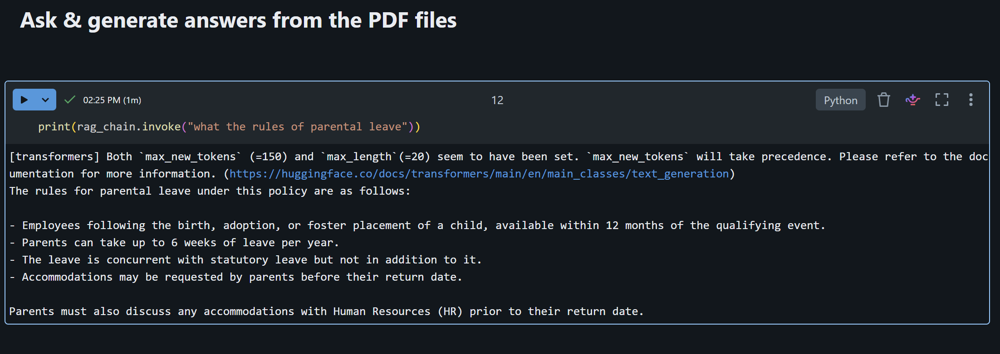
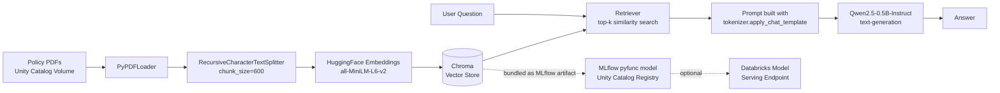
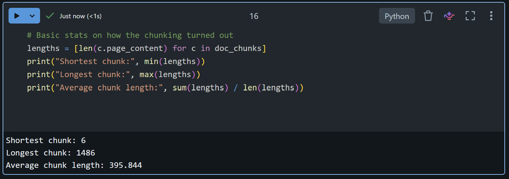
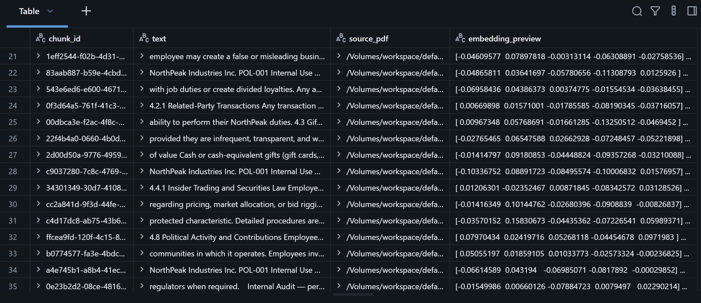

# 📄 Company Policy RAG Assistant


This is a chatbot that answers questions about company policy documents. It's built
using RAG (Retrieval-Augmented Generation), which just means the AI doesn't answer
from memory — it actually goes and reads the real policy PDFs first, finds the part
that matches the question, and then writes the answer based on that.

Everything runs on Databricks, and all the AI models are free and open-source, from
Hugging Face. No API keys, no per-question fees. You just pay for the Databricks
compute you'd already be using anyway.

## Example

```
> print(rag_chain.invoke("What is the company's rule for everyone?"))

The company's rules for everyone include:

- Honesty and Fair Dealing: Employees are not allowed to take unfair advantage of
  anyone by manipulating, concealing, abusing privileged information, or
  misrepresenting material facts.
- Confidential and Proprietary Information: All company records, expense reports,
  and financial statements must be accurate and fair, reflecting all transactions
  and events without any manipulation, concealment, abuse of privileged
  information, or misrepresentation of material facts.
- Fair Competition and Antitrust: Companies are required to maintain fairness and
  competition, avoiding unfair competition and anticompetitive practices.
- Workplace Respect and Non-Discrimination: The company emphasizes workplace
  respect and non-discrimination, ensuring equal treatment and opportunities for
  all employees.
```

That's a real answer, not something I wrote myself. It comes from the model reading
the actual "Code of Conduct & Business Ethics Policy" PDF and summarizing what it
found.

Here's what it actually looks like running in the notebook, on a different question
about parental leave:



## How it works



Here's what each part of the pipeline actually does, with the real code behind it.

### 1. Read the PDFs and split them into small pieces

The code reads every page of every PDF, then splits the text into chunks of about
600 characters each, with a 60-character overlap between them. The overlap matters —
without it, a sentence sitting right on the edge of a chunk can get cut in a way that
loses its meaning.

```python
pdf_documents = []
for file_path in pdf_files:
    pdf_documents.extend(PyPDFLoader(file_path).load())

text_splitter = RecursiveCharacterTextSplitter(chunk_size=600, chunk_overlap=60)
doc_chunks = text_splitter.split_documents(pdf_documents)
```

A quick sanity check on the actual chunk sizes after splitting:



### 2. Turn the text into numbers and save it

Each chunk gets converted into a list of 384 numbers by a small embedding model.
That list of numbers is called an embedding, and it's what lets the computer figure
out how close two pieces of text are in meaning. All of it gets saved into a Chroma
vector database on disk.

```python
embeddings = HuggingFaceEmbeddings(
    model_name="sentence-transformers/all-MiniLM-L6-v2",
    model_kwargs={"device": "cpu"}
)
vector_store = Chroma.from_documents(
    documents=doc_chunks, embedding=embeddings, persist_directory=VECTOR_DB_PATH
)
```

And here's what the embedded chunks actually look like once they're pulled out of
Chroma and displayed as a table — 200 rows, one per chunk, each with its own vector:



### 3. Retrieve and generate the answer (the actual RAG part)

This is the core of the project. When someone asks a question, the code searches the
vector database for the 3 chunks that match it best, combines them with the question
into one prompt, and sends that to the LLM to generate an answer.

```python
retriever = vector_store.as_retriever(search_kwargs={"k": 3})

def build_prompt(inputs):
    messages = [
        {"role": "system", "content": SYSTEM_PROMPT},
        {"role": "user", "content": f"Context:\n{inputs['context']}\n\nQuestion: {inputs['question']}"}
    ]
    return tokenizer.apply_chat_template(messages, tokenize=False, add_generation_prompt=True)

rag_chain = (
    {"context": retriever | format_docs, "question": RunnablePassthrough()}
    | RunnableLambda(build_prompt)
    | llm
    | StrOutputParser()
)
```

I used `tokenizer.apply_chat_template(...)` here instead of writing the prompt tags by
hand. That way, if I switch to a different model later, the prompt still comes out
right without me having to rewrite it.

### 4. Package it for real use

Everything gets wrapped in an MLflow model class so it can be registered to Unity
Catalog and, if needed, turned into a real API later.

```python
class RAGPolicyAgent(mlflow.pyfunc.PythonModel):
    def load_context(self, context):
        # loads the vector store from a bundled MLflow artifact,
        # not from a hardcoded local path — see "Problems I ran into" below
        ...

    def predict(self, context, model_input):
        query = model_input["user_message"].iloc[0]
        return {"response": self.rag_chain.invoke(query)}
```

## What I used

| Layer                     | Tool                                              |
|---------------------------|----------------------------------------------------|
| Orchestration             | LangChain (LCEL chains)                            |
| Embedding model           | `sentence-transformers/all-MiniLM-L6-v2` (Hugging Face) |
| Vector store              | Chroma                                             |
| LLM                       | `Qwen/Qwen2.5-0.5B-Instruct` (Hugging Face)         |
| Compute / notebook        | Databricks                                         |
| Model registry            | MLflow pyfunc + Unity Catalog                      |

All of these models are open-weight and run directly on the cluster's CPU, so there's
no external API key involved and no cost per question beyond the compute itself.

## How to run this

1. Upload your policy PDFs to a Unity Catalog Volume, something like
   `/Volumes/workspace/default/company_policy/`.
2. Open `notebooks/policy_rag_agent.ipynb` in Databricks and run the cells top to
   bottom:

   | Cell | What it does |
   |------|---------------|
   | 1 | Installs the packages you need |
   | 2 | Loads the PDFs, splits them, and saves the embeddings into Chroma |
   | 3 | Builds the RAG chain and tries one test question |
   | 4 | Writes out `agent.py`, the version of the code meant for deployment |
   | 5 | Registers the model into Unity Catalog |

3. Ask it anything, right in the notebook:
   ```python
   print(rag_chain.invoke("What is the travel reimbursement policy?"))
   ```
4. If you want, you can deploy the registered model as a Databricks Model Serving
   endpoint so other apps can call it too — `src/agent.py` is the version built for
   that.

> Sample PDFs aren't included in this repo — you'll need to point it at your own
> documents.

## Project structure

```
policy-rag-agent/
├── README.md
├── LICENSE
├── requirements.txt
├── notebooks/
│   └── policy_rag_agent.ipynb   # the full pipeline, start to finish
└── src/
    └── agent.py                 # standalone copy of the deployable model
```

## Problems I ran into

A few things came up while building this that are worth mentioning:

- **The vector database wasn't saved in the right place.** At first I saved Chroma to
  a `/tmp` folder on the cluster. That's fine while testing in the notebook, but once
  the model actually gets deployed, it runs on a different machine that doesn't have
  that `/tmp` folder at all. So it would quietly load an empty database — no error, just
  wrong-looking answers. I fixed it by bundling the whole vector database folder into
  the MLflow model itself.
- **The prompt format was too specific to one model.** I was writing the prompt
  template by hand using tags like `<|im_start|>`, which only works for that exact
  model. I switched to the model's own `apply_chat_template()` function instead, so it
  keeps working if I swap in a different model later.
- **Answers were getting cut off.** `max_new_tokens` was set too low, so longer answers
  (like the full list of rules above) were getting cut off mid-sentence. I raised the
  limit so it can actually finish what it's saying.

## What I might do next

- Try Databricks Vector Search instead of Chroma, so the data isn't stuck on local
  disk and I can actually browse it inside Databricks like a normal table.
- Swap the small local model for a bigger one through the Databricks Foundation Model
  API, for better answer quality.
- Add some kind of evaluation to measure whether the answers are actually good,
  instead of just checking them by hand.

## License

MIT — see [LICENSE](LICENSE).
