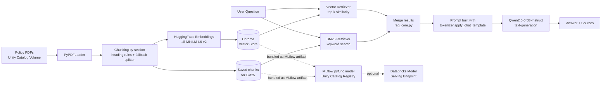

# PolicyRAG
### An open-source RAG chatbot for company policy Q&A, built on Databricks


This is a chatbot that answers questions about company policy documents. It uses RAG
(Retrieval-Augmented Generation), which just means the AI does not answer from memory.
It reads the real policy PDFs first, finds the part that matches the question, and
writes the answer based on that, with a source for every claim it makes.

Everything runs on Databricks, and all the AI models are free and open source, from
Hugging Face. No API keys, no per-question fees. You just pay for the Databricks
compute you would already be using anyway.

## Example

```
> print(rag_chain.invoke("What is the company's rule for everyone?"))

The company's rules for everyone include:

- Honesty and Fair Dealing: Employees are not allowed to take unfair advantage of
  anyone by manipulating, concealing, abusing privileged information, or
  misrepresenting material facts.
- Confidential and Proprietary Information: All company records, expense reports,
  and financial statements must be accurate and fair, reflecting all transactions
  and events without any manipulation, concealment, abuse of privileged
  information, or misrepresentation of material facts.
- Fair Competition and Antitrust: Companies are required to maintain fairness and
  competition, avoiding unfair competition and anticompetitive practices.
- Workplace Respect and Non-Discrimination: The company emphasizes workplace
  respect and non-discrimination, ensuring equal treatment and opportunities for
  all employees.
```

That's a real answer, not something I wrote myself. It comes from the model reading
the actual "Code of Conduct & Business Ethics Policy" PDF and summarizing what it
found.

Here's what it looks like running in the notebook, on a different question about
parental leave:


## How it works



Here's what each part of the pipeline does, with the real code behind it.

### 1. Read the PDFs and split them into chunks by section

The code reads every page of every PDF, then splits the text at section headings it
finds, things like `SECTION 1:`, `3.2 Reimbursement`, `ARTICLE 4`, or a line written
in ALL CAPS. This way, each chunk is a full section, not a random piece of text. Any
text before the first heading, like a title page or short intro, still gets its own
chunk instead of being thrown away. If a section is still too long on its own, it gets
split again into smaller pieces.

```python
HEADER_PATTERN = re.compile(
    r"(?m)^(?:"
    r"(?:SECTION|Section|ARTICLE|Article)\s+\d+[:.\-]?.*|"   # "SECTION 1:", "Article 3 -"
    r"\d+(?:\.\d+)*\s+[A-Z][^\n]{0,80}|"                      # "3.2 Reimbursement"
    r"[A-Z][A-Z0-9 &/,\-]{4,80}$"                              # ALL CAPS HEADING
    r")"
)

def split_by_sections(full_text):
    matches = list(HEADER_PATTERN.finditer(full_text))
    if not matches:
        return [{"text": t, "section": None} for t in _sub_splitter.split_text(full_text)]

    pieces = []
    preamble = full_text[:matches[0].start()].strip()  # keep any text before the first heading
    if preamble:
        pieces.append({"text": preamble, "section": None})

    for i, m in enumerate(matches):
        start = m.start()
        end = matches[i + 1].start() if i + 1 < len(matches) else len(full_text)
        pieces.append({"text": full_text[start:end].strip(), "section": m.group().strip()})
    return pieces
```

Each chunk keeps its source file, page number, and section title as metadata. That is
what makes it possible to show a source for every answer. A quick look at the chunk
sizes after splitting:


### 2. Turn the text into numbers and save it

Each chunk gets turned into a list of 384 numbers by a small embedding model. That
list of numbers is called an embedding, and it lets the computer tell how close two
pieces of text are in meaning. All of it gets saved into a Chroma vector database on
disk. The raw chunks also get saved separately with `pickle`, since BM25 (the keyword
search part of retrieval) is not a saved index like Chroma. It gets rebuilt in memory
from these same chunks whenever it is needed.

```python
embeddings = HuggingFaceEmbeddings(
    model_name="sentence-transformers/all-MiniLM-L6-v2",  # which embedding model to use
    model_kwargs={"device": "cpu"}  # runs fine on CPU, this model is small
)
vector_store = Chroma.from_documents(
    documents=doc_chunks,               # the chunks from the step above
    embedding=embeddings,               # the model that turns each chunk into a vector
    persist_directory=VECTOR_DB_PATH    # where Chroma saves the database on disk
)

with open(CHUNKS_PATH, "wb") as f:
    pickle.dump(doc_chunks, f)  # so BM25 can be rebuilt later, when the model is served
```

Here is what the saved chunks look like once they are pulled out of Chroma and shown
as a table:


### 3. Retrieve and generate the answer (the actual RAG part)

This is the core of the project, and it lives in `src/rag_core.py` so the notebook and
the deployed model use the exact same code. When someone asks a question, two
searches run at the same time: a vector search, which matches by meaning, and a BM25
search, which matches by keyword. Keyword search is good at catching exact things a
meaning-based search can miss, like a policy number, a dollar amount, or a date. The
results from both are combined, with duplicates removed, and used to build both the
answer and a list of sources.

```python
def make_hybrid_retriever(vector_retriever, bm25_retriever):
    def hybrid_retrieve(query):
        vector_docs = vector_retriever.invoke(query)
        keyword_docs = bm25_retriever.invoke(query)
        seen, merged = set(), []
        for pair in zip(keyword_docs, vector_docs):
            for doc in pair:
                if doc.page_content not in seen:
                    seen.add(doc.page_content)
                    merged.append(doc)
        return merged
    return hybrid_retrieve
```

The chunks found by `hybrid_retrieve` are used once: to build the context for the
answer, and to build the list of sources. The system prompt tells the model to add a
`(Source: <file>, page <n>)` tag after every claim it makes, and a separate function
also builds a source list directly from the chunk metadata. That way, what you see
listed as sources is always based on what was actually retrieved, not just on trusting
the model to cite itself correctly.

I used `tokenizer.apply_chat_template(...)` here instead of writing the prompt format
by hand. That way, if I switch to a different model later, the prompt still comes out
right without me having to rewrite it.

### 4. Package it for real use

Everything gets wrapped in an MLflow model class so it can be registered to Unity
Catalog and, if needed, turned into a real API later. `agent.py` does not repeat the
retrieval and prompting code. It imports `build_rag_chain` from `rag_core.py`, the
same file the notebook uses, and that file gets packaged together with it when the
model is saved.

```python
class RAGPolicyAgent(mlflow.pyfunc.PythonModel):  # MLflow's required base class for a custom model
    def load_context(self, context):
        # loads the vector store and saved chunks from bundled MLflow artifacts,
        # not from a hardcoded local path
        ...
        self.rag_chain = build_rag_chain(vector_retriever, bm25_retriever, tokenizer, llm)

    def predict(self, context, model_input):        # runs every time someone calls the deployed model
        query = model_input["user_message"].iloc[0]  # pull the question out of the incoming request
        result = self.rag_chain.invoke(query)
        return {"response": result["answer"], "sources": json.dumps(result["sources"])}
```

## What I used

| Layer                     | Tool                                              |
|---------------------------|----------------------------------------------------|
| Chaining                  | LangChain (LCEL chains)                            |
| Embedding model           | `sentence-transformers/all-MiniLM-L6-v2` (Hugging Face) |
| Vector store              | Chroma                                             |
| Keyword search            | BM25 (`rank_bm25`)                                 |
| LLM                       | `Qwen/Qwen2.5-0.5B-Instruct` (Hugging Face)         |
| Compute / notebook        | Databricks                                         |
| Model registry            | MLflow pyfunc + Unity Catalog                      |

All of these models are open weight and run directly on the cluster's CPU, so there
is no external API key and no cost per question beyond the compute itself.

## How to run this

1. Upload your policy PDFs to a Unity Catalog Volume, something like
   `/Volumes/workspace/default/company_policy/`.
2. Open `notebooks/policy_rag_agent.ipynb` in Databricks and run the cells top to
   bottom:

   | Step | What it does |
   |------|---------------|
   | Install dependencies | Installs the packages needed, including `rank_bm25` and `mlflow` |
   | Load & chunk PDFs | Loads the PDFs, splits them by section, saves embeddings to Chroma, and saves the chunks |
   | Write `rag_core.py` | Writes the shared retrieval, prompting, and citation code to a file |
   | Build the chain | Builds the hybrid retriever and the LLM, puts the chain together, and tries one test question |
   | Write `agent.py` | Writes the file used for deployment, which imports `rag_core.py` |
   | Register the model | Saves and registers the model to Unity Catalog, with `rag_core.py` bundled in |

3. Ask it anything, right in the notebook:
   ```python
   result = rag_chain.invoke("What is the travel reimbursement policy?")
   print(result["answer"])
   print(result["sources"])
   ```
4. If you want, you can deploy the registered model as a Databricks Model Serving
   endpoint so other apps can call it too. `src/agent.py` is the file built for that.

> Sample PDFs are not included in this repo. You will need to point it at your own
> documents.

## Project structure

```
policy-rag-agent/
├── README.md
├── LICENSE
├── requirements.txt
├── notebooks/
│   └── policy_rag_agent.ipynb   # the full pipeline, start to finish
└── src/
    ├── rag_core.py              # shared retrieval, prompting, and citation code
    └── agent.py                 # standalone copy of the deployable model
```

## What I might do next

- Build a simple chat GUI for this, so anyone can type a question and get an answer
  without opening the notebook or writing any code.
- Try Databricks Vector Search instead of Chroma, so the data is not stuck on local
  disk and I can browse it inside Databricks like a normal table.
- Swap the small local model for a bigger one through the Databricks Foundation Model
  API, for better answer quality.
- Add a small set of test questions with known good answers, to check whether hybrid
  search actually works better than vector search alone, instead of just guessing.

## License

MIT, see [LICENSE](LICENSE).
